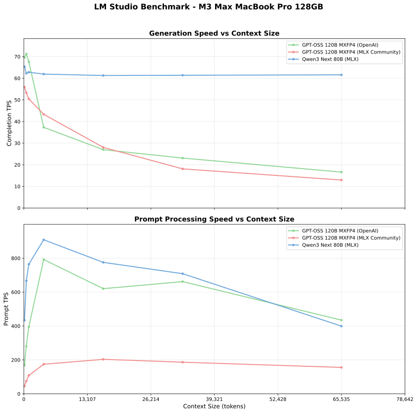

# LM Studio Context Size Benchmark

Measure LM Studio model performance across different prompt lengths without re-running finished experiments. The toolkit wraps realistic prompt generation, streaming-based timing, incremental result storage, and charting utilities so you can focus on the hardware and model comparisons that matter.



## 🚀 Features

- **Streaming Timing** – separates warmup, time-to-first-token, and generation duration using the chat-completions stream.
- **Smart Retry** – scans existing CSVs and only executes missing `(model, context)` combinations, saving new rows as soon as they arrive.
- **Concise Prompts** – slices book content to the desired token budget and asks for constrained bullet-point analyses to keep completions short and comparable.
- **Adaptive Chunking** – estimate prompt tokens with tiktoken so large contexts stay consistent across runs.
- **Detailed Logging** – structured console/file logging with emoji callouts for requests, responses, and errors.
- **One-Click Charts** – regenerate PNG comparison plots and plain-text summaries from any results folder.

## 📋 Requirements

- Python 3.8+
- LM Studio running locally with the HTTP API enabled (defaults to `http://localhost:5002`)
- A PDF (or fallback text) in `books/` for prompt material

## 🛠️ Installation

1. **Clone the repository:**
   ```bash
   git clone https://github.com/latent-variable/LM-Studio-Context-Size-Benchmark.git
   cd LM-Studio-Context-Size-Benchmark
   ```

2. **Install Python dependencies:**
   ```bash
   pip install -r requirements.txt
   ```

3. **Setup LM Studio:**
   - Start LM Studio
   - Load the models you want to benchmark
   - Ensure the API server is running (default: `http://localhost:5002`)

4. **Add a book file:**
   - Place a PDF in `books/` (e.g., `books/harrypotter.pdf`)
   - Update `config.yaml` → `content.book_path` if you use a different file

5. **Configure the benchmark:**
   - Edit `config.yaml` to choose models, context sizes, delays, and output options
   - Run `python config_loader.py` for a quick validation/summary

## 🎯 Usage

### Quick Start
```bash
python smart_benchmark.py
```

### Main Scripts

- `smart_benchmark.py` — end-to-end benchmark runner with incremental saves
- `create_final_charts.py` — rebuild comparison plots/summary for existing results
- `list_results.py` — enumerate stored runs and dump detailed metrics
- `setup.py` — optional helper that installs deps and sanity-checks configuration

### Configuration

Edit `config.yaml` to customise the run. Default structure:

```yaml
api:
  url: "http://localhost:5002"
  timeout: 600
  delay_between_requests: 2
  delay_between_models: 10

system:
  name: "M3 Max MacBook Pro 128GB RAM"
  notes: "4-bit quantization, 8-bit KV-Cache"

models:
  - name: "qwen/qwen3-next-80b"
    enabled: true
    description: "Qwen 3 Next 80B"
  - name: "openai/gpt-oss-20b"
    enabled: true
    description: "GPT-OSS 20B"
  - name: "openai/gpt-oss-120b"
    enabled: true
    description: "GPT-OSS 120B"

test:
  context_sizes: [1000, 10000, 20000]
  max_tokens: 512            # 0 = unlimited
  temperature: 0.1

content:
  book_path: "books/harrypotter.pdf"
  prompt_types:
    - literary_analysis
    - creative_writing_feedback
    - editorial_review
    - lecture_preparation
    - adaptation_analysis

output:
  results_dir: "results"
  create_charts: true
  save_summary: true

charts:
  dpi: 300
  figure_size: [16, 8]
  colors:
    "qwen/qwen3-next-80b": "#d62728"
    "openai/gpt-oss-20b": "#ff7f0e"
    "openai/gpt-oss-120b": "#2ca02c"
    "default": "#1f77b4"
```

## 📊 Output Structure

By default all results live in the `results/` folder:

```
results/
├── .gitkeep
├── benchmark.log
├── benchmark_summary.txt
├── benchmark_comparison_charts.png
├── benchmark_comparison_charts.svg
├── openai_gpt_oss_20b_results.csv
├── openai_gpt_oss_120b_results.csv
└── qwen_qwen3-next-80b_results.csv
```

- CSV files contain one row per `(model, context_size)` and are de-duplicated on write.
- `benchmark.log` mirrors the console output at DEBUG level.
- Running `create_final_charts.py` regenerates the chart/summary at any time.
- `benchmark_comparison_charts.png` / `.svg` are checked-in quick-look charts so you can preview results without re-running the plotting script.

## 🧠 How It Works

### Timing Workflow

1. Optional warmup request ensures the model is resident before the first measurement.
2. Streaming chat completion captures time-to-first-token and generation duration precisely.
3. A lightweight non-streaming probe retrieves usage token counts when available.
4. Fallback token estimation uses `tiktoken` for approximate counts when the API omits usage data.

### Smart Benchmarking

1. Scan existing CSVs in `results/`.
2. Compute missing context sizes for each enabled model.
3. Execute only the gaps, saving each measurement immediately.
4. Merge new data with old when generating charts and summaries.

### Realistic Prompts

- Uses actual book content chunked to specific token sizes
- Simulates agentic coding scenarios with analysis prompts
- Provides consistent, reproducible test conditions

## 📈 Metrics Reported

- **Time to First Token (TTFT)** — seconds from request to first streamed token
- **Generation Time** — total seconds spent streaming tokens
- **Tokens per Second** — completion tokens divided by generation time (approximate if usage data missing)
- **Prompt Processing Speed** — prompt tokens divided by TTFT
- **Total Time** — wall-clock duration of the request
- **Prompt / Completion Tokens** — usage-based when available, otherwise estimated with tokenizer fallback

## 🔧 Advanced Features

### Comprehensive Logging

Every operation is logged with:
- Timestamps and execution details
- API request/response information
- Timing measurements and variations
- Warning detection for loading delays
- Performance metrics and analysis

### Error Handling

- Automatic retry logic for failed requests
- Graceful handling of model loading delays
- Detailed error reporting and logging
- Partial result preservation

### Performance Analysis

- Generate combined charts for generation speed and prompt ingestion.
- Emit a plain-text summary with per-model ranges and context coverage.
- Review the CSVs directly for integration into your own dashboards.

## 📁 Key Files

- `smart_benchmark.py` — smart benchmark runner
- `accurate_timing.py` — streaming timing utilities
- `book_loader.py` — PDF loader and prompt generator
- `config_loader.py` — configuration IO/validation helpers
- `create_final_charts.py` — chart/summary generator
- `list_results.py` — CLI helper for inspecting CSVs
- `setup.py` — optional bootstrapper
- `config.yaml` — default configuration
- `requirements.txt` — Python dependencies

Source modules such as `logger.py` and `accurate_timing.py` are imported by the runner; there is no separate `benchmark.py` or `multi_model_benchmark.py` in this repo anymore.

## 🎨 Example Results

The benchmark generates detailed performance charts showing:
- Generation speed vs context size
- Time to first token vs context size  
- Prompt processing speed vs context size
- Comparative analysis across models

## 🤝 Contributing

1. Fork the repository
2. Create a feature branch
3. Make your changes
4. Add tests if applicable
5. Submit a pull request

## 📄 License

This project is open source. Feel free to use and modify as needed.

## 🐛 Troubleshooting

### Common Issues

1. **Model Loading Delays**: The system automatically detects and handles model loading time
2. **API Timeouts**: Increase timeout values in `config.yaml`
3. **Memory Issues**: Reduce context sizes or test fewer models simultaneously
4. **Book Loading Errors**: Ensure your PDF is readable and in the `books/` directory

### Getting Help

- Check the detailed logs in `results/run_*/benchmark.log`
- Use `python list_results.py` to analyze existing results
- Run `python setup.py` to validate your configuration

## 🔬 Technical Details

### Timing Accuracy

The benchmark uses a hybrid approach:
1. Non-streaming request for accurate token counts
2. Streaming request for precise timing measurements
3. Multiple measurements with statistical analysis
4. Intelligent filtering of loading-related delays

### Smart Experiment Management

- Scans all previous results across all runs
- Identifies missing combinations of models and context sizes
- Preserves existing data while adding new measurements
- Enables incremental testing and model comparison

This ensures efficient use of compute resources and enables iterative experimentation without redundant work.
-
